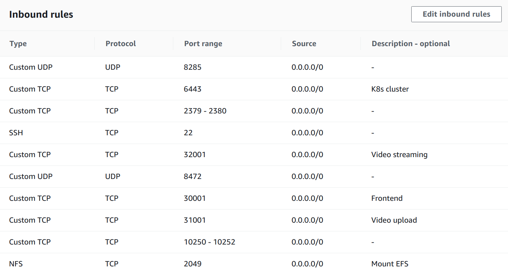
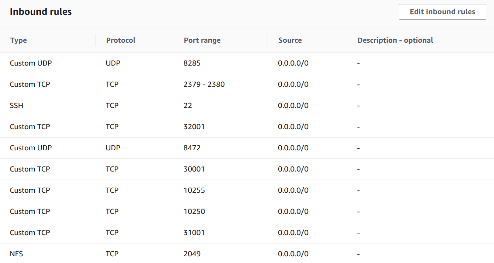

# Final Year Project K8s Set-Up (Video Streaming System/WebApp: Vidhyapak)

1. JAR for all microservices are in their respective directory.
2. These directories also contain it's corresponding *Dockerfile* to containerize the same.

### Deployment Part

3. Create EC2 t2.micro instance for *database server*. Install **MySQL** in it. Setup each databases in it, schema and data information for each of them is given in *db/* directory. Also set max connections to 512 in mysql config. Setup a user with username *admin* and password *Admin@123*, and allow remote connections to this user. Also allow required port (3306 in this case) for incoming traffic in security group of this instance for remote connections. Empty all data in *VideoUpload* and *VideoStreaming* databases.

4. Create another EC2 t2.micro instance for *cache server*. Install **Redis** server. Replace */etc/redis/redis.conf* with *conf/redis.conf*. Also allow required port (6379 in this case) for incoming traffic in security group of this instance for remote connections.

5. Create 4 or more EC2 t2.medium instance for the application. One of them will act as k8s master node and others will be worker nodes. Create two seperate security groups for master and workers nodes. Append below inbound rules in master's security group,



Append below inbound rules in worker's security group,



[Reference1](https://kubernetes.io/docs/setup/production-environment/tools/kubeadm/install-kubeadm/#check-required-ports)

[Reference2](https://github.com/coreos/coreos-kubernetes/blob/master/Documentation/kubernetes-networking.md)

Also, create an Elastic IP for master node.

6. Create EFS file system for video data storage. Make sure it can be mounted (if not) in worker nodes by configuring security settings.

7. In master node, Execute lines 1 to 16 from *k8s/setup_worker.sh*. Copy *k8s/kube-flannel.yml* in home dir. Follow commands in *k8s/master.yml* step by step. In all worker nodes, execute *k8s/setup_worker.sh*, modify last command depending on the EFS created (mount point should be **/mnt** in worker nodes) from above step. Command (about how to mount nfs) can be copied from EFS settings in AWS. **When EFS is mounted for first time in workers, create 2 directories /mnt/shared/processed_files and /mnt/shared/unprocessed_files from any one worker node (Do this once when EFS is created).**

8. Run ```sudo kubeadm token create --print-join-command``` in master node, copy output and replace it with hash on line 25 of *k8s/workers.yml*. Run command on line 24 of *k8s/workers.yml* (**including the newly pasted hash and also update ipv4 of that of master node**) in all worker nodes to connect them to the master node. Run ```kubctl get nodes``` in master, and check k8s cluster is setup and running. All nodes shoud be in **READY** state. 

---
#### Note
* Run *k8s/reset.sh* in master node to break down the cluster and reset everything.
* For easiness, copy required files into VMs itself.
---

9. Copy all JARs to master node's home directory. Build containers by executing [containerize.sh](containerize.sh) in master node. Replace $dataIP and $redIP values with database server and redis server IPs' respectively (Run ifconfig command in them). Replace value of $hIP with that of elastic IP of master node created in step 5. Docker hub login is required. Also public repo called *vidhyapak* has to be created in docker hub account (change username in [containerize.sh](containerize.sh) if required).

10. Execute *YAMLs/up.sh* to run the application. Configurations for each service is defined in *YAMLs/{service name}-deployment.yaml*. To bring down the application run *YAMLs/down.sh*. Remember for application to work when VMs are started, make sure database server, cache server, master node and at least 2 worker nodes are successfully running; Also EFS has to be mounted in worker nodes (look command at *k8s/mount.txt*, change efs specs).

11. Go to *{master node's elastic IP}:30001/login* in browser and check if we are getting the login screen. Login using below ids. Upload any zip from *uploadFiles/* directory with faculty level credentials. Wait for some time till file is uploaded and processed. Refresh video upload page after popup is closed and check if it's available. Once available, go to home page, then faculty's folder, course folder. Try to play the video and download document files.